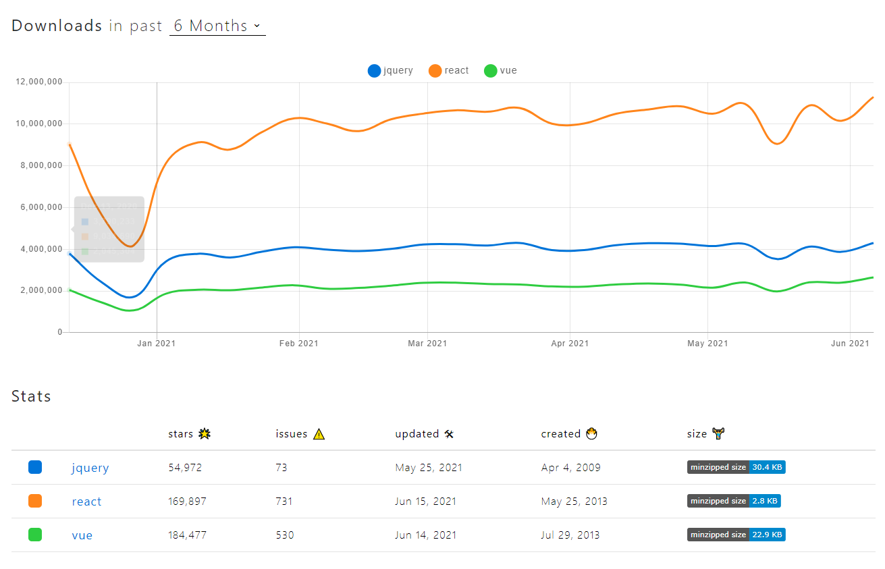
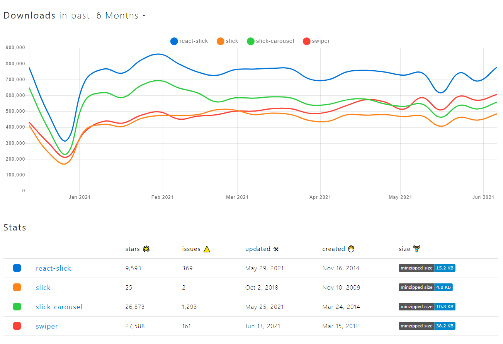

# Line Games 코딩 테스트

## 공통 내용

### IDE

- VS코드로 작업
- 사용한 Extension: Live Sass Compiler, Prettier

### JavaScript 라이브러리 선별



- 최근 6개월 가장 많은 다운로드 수를 차지하고 있는 react, jquery를 선택
- React.js가 전세계적으로 가장 각광을 받고 있는 반면, Vue.js의 인기가 점점 떨어지고 있음을 실감했다.
- Stars: react > vue > jquery
- Issues: react > vue > jquery
- Downloads: react(압도적) > jquery > vue
- 결론: 리액트, 앞으로도 더 열심히 해야겠다.

<hr />



- 최근 6개월 가장 높은 stars와 다운로드 수를 차지하고 있는 react-slick, slick를 선택

<hr />

## jQuery 버전

- Internet Explorer 8 버전까지 크로스 브라우징
  - 기존 라인게임즈의 크로스 브라우징 문제를 해결
- 정적인 HTML5 환경에 CSS는 scss로 작업
- 플러그인 버전은 크로스 브라우징을 위해서 ie 하위버전까지 지원하는 버전을 선별하여 사용
  - jQuery(v1.11.1), slick(v1.6.0)

<hr />

## React 버전

- 노드 환경에서 구동할 수 있다.
  - [Node.js 다운로드](https://nodejs.org/en)
  - 설치 버전은 14.17.0 LTS 권장
- 웹팩 데브 서버 구축 이후 프론트 서버 환경에서 구축
- Internet Explorer 11 버전부터 지원

### 서버 구동

```command
npm i
npm run dev
```

- [확인 URL](http://localhost:3090)

<hr />

### 후기

- 처음 이미지 한 장 보고 어떻게 해야할 지 난해했는데, 나름 재미있는 과제였던 것 같습니다. 앞으로도 프레임워크나 라이브러리에 제한하지 않고 창조적이고 유연한 퍼블리셔가 되고 싶다고 다짐하는 계기가 되었습니다. 좋은 기회, 좋은 경험 주셔서 감사합니다. :)
