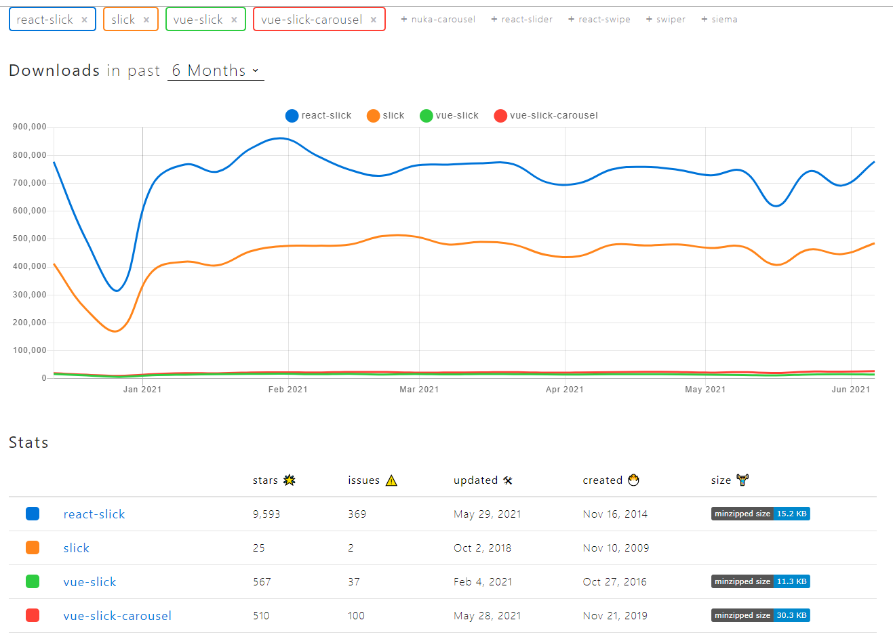

# Line Games 코딩 테스트

## 공통 내용

### IDE

- VS코드로 작업
- 사용한 Extension: Live Sass Compiler, Prettier
- jQuery는 정적인 html로 작업
- React는 노드js로 프론트 서버(웹팩데브서버) 구축 이후 작업

### 라이브러리 선별



- npm 트렌드를 확인

## jQuery

- Internet Explorer 8 버전까지 크로스 브라우징

## React

- 코드 실행 명령어

```command
npm i
npm run dev
```

- Internet Explorer 11 버전부터 지원

- [확인 URL](http://localhost:3090)
